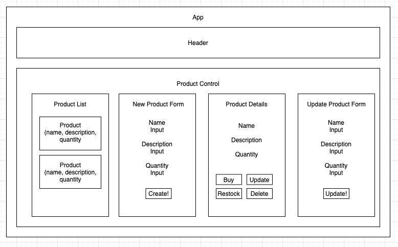

# _Merch Store_

_18 November 2020_

#### _Website for fake merchandise store_

#### By _**Vanessa Stewart**_

## Description

_This is an exercise for Epidocodus to practice making a React website with full CRUD functionality. The original instructions include:_

Build a website for selling merchandise for a band, author, sports team, or any other purveyor that interests you.

A user should be able to do the following:
Create, Read, Update and Delete items in the store. Items should have fields for name, description, and quantity (along with any other fields you wish to add).
Increase or decrease the quantity of an item in the store. For instance, if a user clicks "Buy", the quantity will decrease by one. If a user clicks "Restock", it will increment by a specified number.
When the quantity of an item is reduced to 0, the item should say "Out of Stock". A user should not be able to reduce the quantity of an item below 0.

Further Exploration
Create a Cart component. When a user clicks "Buy", the specified item should be added to the cart.
A user should be able to view and remove items from the cart.
Create a widget that shows the number of items in the cart. This widget should be updated when items are added to the cart.

## Website Planning

## Setup/Installation Requirements

* Navigate to the directory in which you would like to clone this project.
* Run `git clone https://github.com/vanmars/merch-site.git` in terminal.
* Run `cd merch-site` to navigate into new project directory.
* Open the cloned repo in a text editor of your choice.
* Run `npm install` to download all dependencies.
* Run `npm start` to start a live server and view projec in the browser.
* Run `npm run test` to run tests.

## Known Bugs

_There are no known bugs at this time. But the following items could be improved:_

* Add more styling
* Refactor Product List
* Enable sorting of master product list on display page
* Include form checks so that users can't enter non-numbers or negative numbers for product quantities.

## Support and Contact Details

_Connect with me at vamariestewart@gmail.com with ideas to improve this project._

## Technologies Used

* HTML
* CSS
* JavaScript/React
* Webpack
* NPM

### License

Copyright (c) 2020 **_Vanessa Stewart_**

Permission is hereby granted, free of charge, to any person obtaining a copy of this software and associated documentation files (the "Software"), to deal in the Software without restriction, including without limitation the rights to use, copy, modify, merge, publish, distribute, sublicense, and/or sell copies of the Software, and to permit persons to whom the Software is furnished to do so, subject to the following conditions:

The above copyright notice and this permission notice shall be included in all copies or substantial portions of the Software.

THE SOFTWARE IS PROVIDED "AS IS", WITHOUT WARRANTY OF ANY KIND, EXPRESS OR IMPLIED, INCLUDING BUT NOT LIMITED TO THE WARRANTIES OF MERCHANTABILITY, FITNESS FOR A PARTICULAR PURPOSE AND NONINFRINGEMENT. IN NO EVENT SHALL THE AUTHORS OR COPYRIGHT HOLDERS BE LIABLE FOR ANY CLAIM, DAMAGES OR OTHER LIABILITY, WHETHER IN AN ACTION OF CONTRACT, TORT OR OTHERWISE, ARISING FROM, OUT OF OR IN CONNECTION WITH THE SOFTWARE OR THE USE OR OTHER DEALINGS IN THE SOFTWARE.
